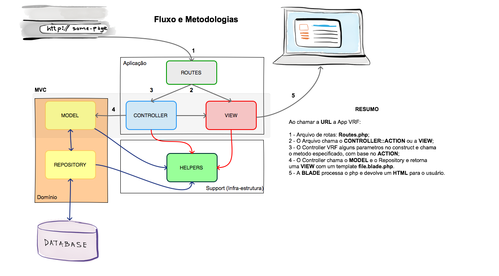
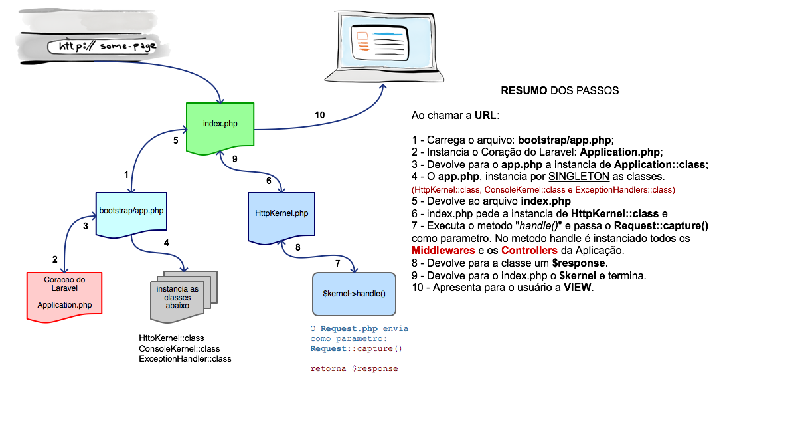

# Projeto: Esqueleto Laravel 5.3 com DDD

## Nota:

O propósito deste trabalho é apresentar uma alternativa do Laravel dividido em módulos próximo ao formato do **Domain Driven Design (DDD)**, baseado nos conceitos praticados pelos amigos do [Codecasts][codecasts], que desde já agradeço por compartilhar conosco as experiencias em desenvolvimento com Laravel, meus parabéns a equipe.

A ideia é dividir em *microserviços* o Laravel, onde na camada de **Domínio** terá o conteúdo do negócio em si, esta camada é a mais importante, pois terá todas as regras de negócios da aplicação e será dividida por assunto/contexto de determinado negócio. Essa camda não depende do Framework.

Exemplos:

* **Usuários**
	* Grupos
	* Permissões
* **Fórum**
	* Perguntas
	* Respostas
* **Blog**
	* Categorias
	* Tags
	* Cometários

Em **Applications**, terá tudo aquilo que se constroi em **cima do Framework**, pois não tem a pretensão de ser portável para outras plataformas, então está ligada o Framework usado.

Por sua vez, a camada **Support**, terão artefatos que **não fazem parte do Domínio**, pois será composto de algo abstraível e podem no futuro se transformar em pacotes para serem usados em outros sistemas.

A figura abaixo demonstra a ideia que esse trabalho representa.



A próximo figura é só para mostrar o que o Laravel executa internamente até apresentar uma view ao navegador.



### Premissas:

* Laravel 5.3

### Alguns passos executados para a alteração do Laravel

1 - Clonar o esqueleto do Laravel 5.3.

```bash
# Clonar o Laravel 5.3 
$ composer create-project laravel/laravel --prefer-dist base_ddd
```

2 - Criar dentro de "app/", a pasta Domains e Users, de modo a refatorar a estrutura atual e colocar tudo pertinente ao domínio usuário nesta pasta.

```bash
# Criar o diretorio Domains dentro de App
$ mkdir app/Domains
$ mkdir app/Domains/Users
$ mkdir app/Domains/Users/Database/Migrations
``` 
3 - Alterar a localização no arquivo `config/auth.php`.

```php
...
# Alterar arquivo de config/auth.php
'providers' => [
        'users' => [
            'driver' => 'eloquent',
            'model' => App\Domains\Users\User::class,
        ],     
...        
``` 
4 - Criar dentro de `app/Domains/Users/Database`, a pasta `Migrations`, para poder trabalhar com migrations diferente do padrão normal que o laravel usa. Vamos usar um pacote desenvolvido pela [Equipe do Codecasts][codecasts] chamado de **"Migrator"**. Para mais detalhes acesse os links do Pacote Migrator: [Packagist][migrator] | [GitHub Artesaos][github-migrator] | [Packalyst][packalyst-migrator].

```bash
# Clonar o pacote Migrator 
$ cd base_ddd
$ composer require artesaos/migrator
```

Dentro do arquivo `config/app.php` add o provider.

```php
...
/*
 * Package Service Providers...
 */
Migrator\MigrationServiceProvider::class,
...
```

5 - Vamos criar um diretório chamado `Support`, que será colocado lógica que foge do escopo do **Domínio**, que poderá ser utilizado posteriormente como um pacote, ou seja, essa camada existe para centralizar o tipo de classe que não se encaixa com com o Domínio da aplicação, podem ser facilmene distribuídos como pacotes no composer posteriormente. Exemplos, Base de Repositórios e models, camdadas de pagamento, sistema de notificação... qualquer artefato que possa ser transferido como um pacote genérico.

```bash
# Criando as pastas
$ mkdir app/Support
$ mkdir app/Support/Domain
```
Para facilitar, irei disponibilizar o link da classe, [Migration](https://github.com/codecasts/confee-api/blob/master/app/Support/Database/Migration.php), estratégia extraída do site [Codecasts][codecasts]. Para mais detalhes dessa estratégia acesse, [GitHub do Codecasts][github-codcasts].

Mais uma vez a equipe do Codecasts desenvolveu um pacote para abstrair esse tipo de conceito, eu não estou utilizando neste esquelete o pacote, mas caso deseje basta adicionar pelo composer o pacote, [codecasts/support](https://packagist.org/packages/codecasts/support)  que está na versão 1.1.

```bash
$ composer require codecasts/support
```

6 - Criar a estrutura de pastas conforme o código do esqueleto dentro de `app\Domains\Users\`.

7 - No Domínio `app\Domains\Users\`, existe uma pasta `Providers` e nela uma classe  `DomainServiceProvider.php`, responsável por prover as "Migations" ao executar o comando de migração no bash do laravel. Para que essa estratégia funcionen corretamente é preciso registrar no arquivo `config\app.php` o `DomainServiceProvider.php`.

```php
<?php
...
/**
* Domains Service Providers...
*/
App\Domains\Users\Providers\DomainServiceProvider::class,

```

Dessa forma ao executar o comando do artisan para migrar as tabelas na **ordem definida** conforme encontra-se no arquivos de cima para baixo.

```bash

anders@ubuntu-brian (feature/alt-ddd) ~/www/base_ddd:
$ php artisan migrator
Migrated: App\Domains\Users\Database\Migrations\CreateUsersTable
Migrated: App\Domains\Users\Database\Migrations\CreatePasswordResetsTable

```

8 - Criar um diretório dentro de `app`, chamado `Applications` ou `Units`, resolvi chamar de `Applications`, o seu conteúdo será arquivos atinentes a aplicação do framework, por exemplo, camadas I/O de Software, camda de Http, pate de *frontend*. Essa camda é considerada "burra", pois **não irão** conter **regras de Negócio**, sua principal responsabilidade é a comunicação entre os usuários, podendo até ser outras aplicações, e as outras camadas. Essa camada não será portável para outras plataforma, pois fazem parte do contexto da plataforma pelo qual ela está inserida.  Os diretórios criados dentro de Applications, serão tarefas especícas dentro da aplicação.

```bash
anders@ubuntu-brian (feature/alt-ddd) ~/www/base_ddd:
$ mkdir app/Applications
$ mkdir app/Applications/Authentication
$ mkdir app/Applications/Authentication/Providers
$ mkdir app/Applications/Authentication/Http
$ mkdir app/Applications/Authentication/Http/Controllers
$ mkdir app/Applications/Authentication/Resources
```
Alterar os namespace desses arquivos movidos para:

```php
...
namespace App\Applications\Authentication\Http\Controllers;
...
```

9 - Criar uma classe abstrata dentro de `app/Support/Http/Controllers`, ou melhor mover a classe `App\Http\Controllers\Controller.php` para o diretório em questão. A equipe do [Codecasts][codecasts], desenvolveu um pacote bem interessante que pode ser usado, [leia mais](https://packagist.org/packages/codecasts/support). Só não estou utilizando, pois quero modificar o mínimo possível da  estrutura do Laravel, mas você pode ficar a vontade.

```bash
$ mv app/Http/Controllers/Controller.php app/Support/Http/Controllers/
```
Veja o código compartilhado no esqueleto e altere da mesma forma.


10 - A estrutra tem ainda, um diretório chamado `Core` dentro de `app/Applications/`, para mover o middlewares e outros arquivo do Laravel que não se enquadram nas camadas Applications, Domains and Support.

```bash
# criando pastas
$ mkdir -p app/Applications/Core/Http/Middleware

#  mover middlewares
$ mv app/Http/Middleware/* app/Applications/Core/Http/Middleware/

```
Alterar namespace dos Middlewares:

```php
...
namespace App\Applications\Core\Http\Middleware;
...
```

11 - Mover o arquivo `app/Http/Kernel.php` para dentro da pasta `app/Applications/`, de mode que ele será compartilhado com os outros módulos da aplicação Laravel.

```bash
$ mv app/Http/Kernel.php app/Applications/HttpKernel.php
```

12 - Mover o arquivo `app/Exceptions/Handler.php` para `app/Applications/ExceptionHandler.php` e refatore o namespace.

```bash
$ mv app/Exceptions/Handler.php app/Applications/ExceptionHandler.php
```
Mover o arquvo `app/Console/Console.php` para `app/Applications` e refatore o namespace.
```bash
$ mv app/Console/Console.php app/Applications/ConsoleKernel.php
```

13 - Refatore o módulo `Applications/Authentication/` de acordo com o código compartilhado no esqueleto.

14 - Os arquivos `RouteServiceProvider.php` e `EventServiceProvider.php` serão dispnibilizados em cada módulo que for criado dentro de Applications.

15 - Foram criados classes de rotas ao invés de arquivos simples conforme o padrão normal do Laravel 5.3, de modo que ficrão disponibilizados dentro de cada módulo, localizados na camada `app/Applications/`, ou seja, cada módulo na camada `Applications`terá sua classe de rotas especificas. Portanto, no esqueleto compartilhado, terão as classes `Api.php Web.php Console.php`, para o módulo `app/Applications/Authentication/Routes` e para o módulo, `app/Applications/Home/Routes`.

16 - Existirá um provider único que irá registrar todos os providers do módulo, de modo que só ele seja registrado no `config/app.php`.

- A classe ServiceProvider.php em `app/Support/Units/`, irá auxiliar os providers dos modulos;
- A classe UnitServiceProvider.php em `app/Applications/Authentication/Providers/` e no `app/Applications/Home/Providers/`, conforme o esqueleto é que serão registradas no `config/app.php`.

17 - O modulo `Authentication`, possui as views dentro dos respectivos diretórios.

- login.blade.php, dentro de `app/Applications/Authentication/Resources/Views/`
- register.blade.php, dentro de `app/Applications/Authentication/Resources/Views/`
- email.blade.php, dentro de `app/Applications/Authentication/Resources/Views/passwords/`
- reset.blade.php, dentro de `app/Applications/Authentication/Resources/Views/passwords/`

18 - As classes abaixo foram refatoradas para atender a modularização:

- ForgotPasswordController.php, dentro de `app/Applications\Authentication\Http\Controllers/`
- LoginController.php, dentro de `app/Applications\Authentication\Http\Controllers/`
- RegisterController.php, dentro de `app/Applications\Authentication\Http\Controllers/`
- ResetPasswordController.php, dentro de `app/Applications\Authentication\Http\Controllers/`

19 - O diretório `Core`dentro de `Applications`terão arquivos de views, que servirão para **layouts** da aplicação.

- app.blade.php, em `app/Applications/Cores/Resources/Views/layouts`

20 - O módulo Home em `app/Applications/` é um exemplo de módulo que poderá ter neste formado de modularização.


### Pacotes de terceiros usados para auxiliar na modularização

```json
{
    "require": {
        "artesaos/migrator": "^1.1",
        "league/fractal": "^0.14.0",
        "artesaos/warehouse": "2.x-dev"
    },
    "require-dev": {
        "fzaninotto/faker": "~1.4",
    }
}

```

 
[migrator]: https://packagist.org/packages/artesaos/migrator
[github-migrator]: https://github.com/artesaos/migrator
[packalyst-migrator]: http://packalyst.com/packages/package/artesaos/migrator
[codecasts]: https://codecasts.com.br/
[github-codcasts]: https://github.com/codecasts/codecasts


[GitLab]: http://www.gitlab.com
[fluxo]: https://gitlab.com/dagoba/dagoba_code/wikis/fluxo-do-git-flow
[comandos-git-flow]: https://github.com/nvie/gitflow/wiki/Command-Line-Arguments


